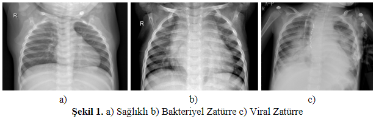
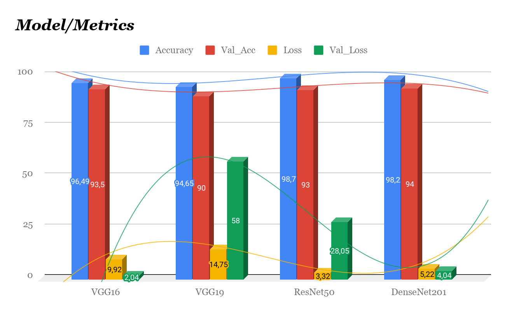

<h1 align="center">
  Derin Öğrenme ile Zatürre Hastalığı Teşhisi ve Diğer Derin Öğrenme Modellerinin Kullanılması Durumundaki Başarımının Karşılaştırılması
</h1>

Zatürre Hastalığı, insanın hayatının herhangi bir döneminde karşılaşabileceği hastalıklardan biridir. Enfeksiyon hastalıklarının yaklaşık %18’ini zatürre hastalığı oluşturmaktadır. Bu hastalık ilerleyen bazı durumlarda ölüme sebep olabilmektedir.
Tıbbi olarak zatürre teşhisini kesin olarak konulabilmesi için akciğer röntgen görüntülerinin bir doktor tarafından incelenmesi gereklidir. Bu çalışmada, zatürre hastalığının teşhisi için geliştirilen tanıma sistemi için erişime açık olan akciğer röntgen görüntülerinden faydalanılmıştır. Elde edilen veri kümesinde öznitelik çıkarımı için derin öğrenme modellerinden evrişimsel sinir ağı (ESA) kullanılmıştır. 

Hastalığın teşhisi için elde edilen öznitelikler farklı derin öğrenme modelleri kullanılarak başarım karşılaştırmaları yapılmıştır.
Bu projede amaç ülkemizde her ilçede uzman doktor bulunmamaktadır bu geliştirilen sistem sayesinde röntgen filmi sisteme yüklenerek bir karar destek mekanizması oluşturmaktır.

<h2 align="center">
  VERİSETİ
</h2>

Tıbbi alanda doktorların göğüs röntgenine bakıp teşhis koyması, günümüz teknoloji çağında zaman kaybettiren bir süreçtir. Bunun yerine var olan teknolojik imkânlardan ve yazılımlardan faydalanarak teşhis yapabilmek, zaman ve maliyet açısından son derece olumlu bir gelişmedir.

Bu çalışmada, erişime açık olan (1-5) yaş arası küçük çocukların göğüs röntgeni görüntüleri kullanılmıştır. Veriseti 3 klasör halinde düzenlenmiş (train, test, val) ve her görüntü kategorisi içinde (Pneumonia / Normal) adı altında klasörler barındırmaktadır. 5.863 röntgen görüntüsü (JPEG) formatında 2 kategori (Pneumonia / Normal) bulunmaktadır. 
Verisetine bu bağlantı üzerinden ulaşabilirsiniz.

  

<h2 align="center">
  SONUÇLAR
</h2>
 Öncelikle araştırma yaptığımda kullanılan klasik ağ modellerinde normalde sınıflandırıcı katmanında yani son katmanda “softmax” aktivasyon fonksiyonu kullanılıyordu fakat “softmax” fonksiyonu ile modeller büyük kayıp değerlerine sahip oldular. Bu yüzden son katmanda aktivasyon fonksiyonu olarak “sigmoid” kullandım. 
Modellerin eşit sayıda turları, öğrenme oranları vs. tüm parametreleri eşit olarak ağ eğitime sunulmuştur. Oluşturulan modeller kesinlikle transfer öğrenme şeklinde değil modellerin yalın hali ile yani önceden eğitim olmaksızın eğitim sıfırdan yapılmıştır.
Modellerin başarısını karşılaştırdığımızda DenseNet, ResNet’in ve Vgg16 doğrulama ve normal başarı oranlarının birbirine yakın olup optimuma yakın sonuçlar verdiği gözlenmiştir.

  

